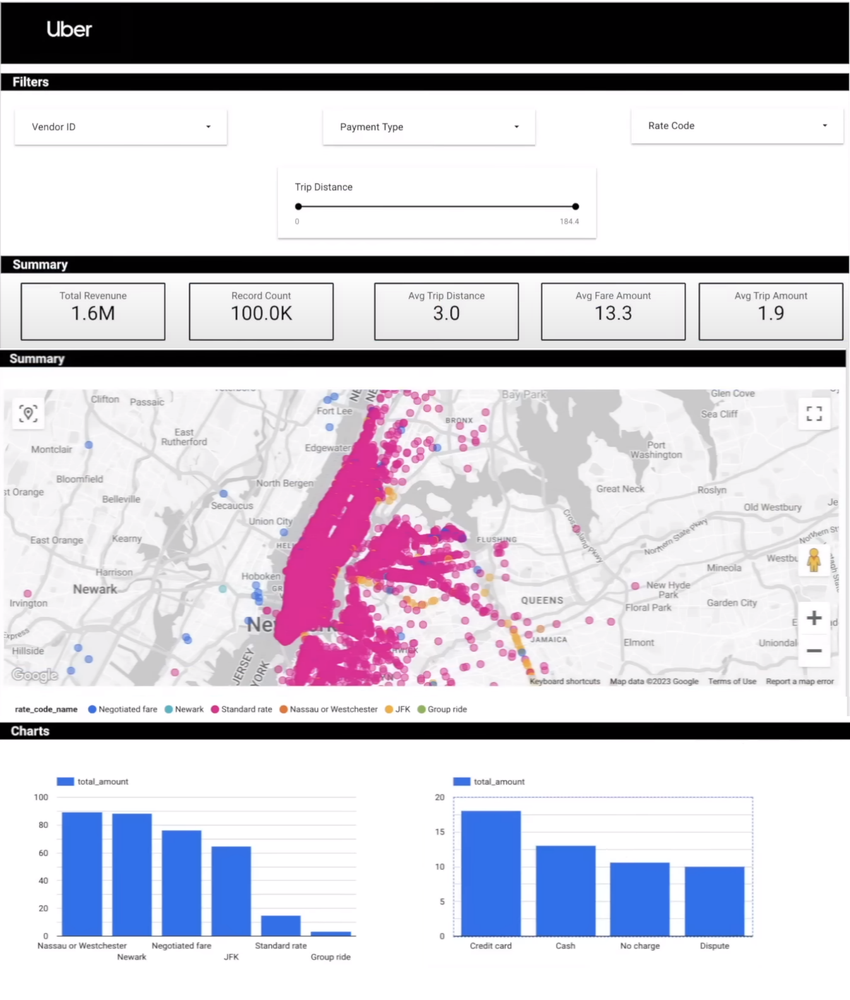

# Uber Data Analytics | Modern Data Engineering GCP Project

## Introduction

The goal of this project is to perform data analytics on Uber data using various tools and technologies, including GCP Storage, Python, Compute Instance, Mage Data Pipeline Tool, BigQuery, and Looker Studio.

## Uber Data Pipline Project Insights Dashboard

## Architecture

## Technology Used
- Programming Language - Python

Google Cloud Platform
1. Google Storage
   Google Cloud Storage is an online file storage service provided by Google as parts of its cloud computing Platform.
   It allows you to store and retrieve data in the cloud making it accessible from anywhere with an internet connection
2. Compute Instance
   An instance is a virtual machine (VM) hosted on Google's infrastructure
   The terms Compute Engine instance, virtual machine instance , VM instance, and VM are synonymous.
   They are used interchangeably in the Google Cloud console, the gcloud command-line tool, and the REST API
3. BigQuery
   BigQuery is a fully managed enterprise data warehouse that helps you manage and analyse your data with built-in features like machine learning, geospatial analysis, and business intelligence.
4. Looker Studio
   Business Insights Visualizations: Looker Studio turns your data into fully customizable informative reports and dashboards that are easy to read and share. Insights can be gathered from a variety of sources, including
   Google Analytics, Google Sheets, BigQuery.

Modern Data Pipeine Tool - https://www.mage.ai/
Mage is an open-source data pipeline tool for transforming and integrating data

Contibute to this open source project - https://github.com/mage-ai/mage-ai

## Dataset Used
TLC Trip Record Data
Yellow and green taxi trip records include fields capturing pick-up and drop-off dates/times, pick-up and drop-off locations, trip distances, itemized fares, rate types, payment types, and driver-reported passenger counts.

Here is the dataset used in the video - https://github.com/darshilparmar/uber-etl-pipeline-data-engineering-project/blob/main/data/uber_data.csv

More info about dataset can be found here:
1. Website - https://www.nyc.gov/site/tlc/about/tlc-trip-record-data.page
2. Data Dictionary - https://www.nyc.gov/assets/tlc/downloads/pdf/data_dictionary_trip_records_yellow.pdf

## Data Model

## Step 1: Creating Fact & Dimension Table

Fact Table:
- Contains the quantitative measures or metrics used for analysis
- Typically contains foreign keys that link to dimension tables
- Contains columns that have high cardinality and change frequently  
- Contains columns that are not useful for analysis by themselves, but are necessary for metric calculation

Dimension Table:
- Contains columns that describe attributes of the data being analysed
- Typically contains primary keys that link to fact tables
- Contains columns that have low cardinality and do not change frequently
- Contains columns that can be used for grouping or filtering data for analysis

Jupyter Notebook (pandas) and the data csv file:

Change Pickup_datetime and dropoff_datetime rom object data type to datetime type. This allows extraction of information from the data.

Using the data model, reset the index and drop the duplicates. Then extract the required hour, day, month, year, weekday and assign to the new columns created for pick hour, pick day, pick month, etc.

Order the data into the correct format ensuring the correct primary key.

For all required data in the data model, drop dupliclicates, reset the index, assign the index to the required ID column and reorder the information as per the data dimension model.

For ratecodeID, we require the rate_code_name which is not in the data frame.
Therefore, create a data dictionary, drop the duplicates, reset the index, and assign the index to ratecodeID. Use the rate_code_name and map to the ID so the value is assigned to the standard rate. Finally reorder as per the data model.

NOw all Dimension Tables created, create the Fact Table by joining the dimension tables based on the common columns between the tables.

