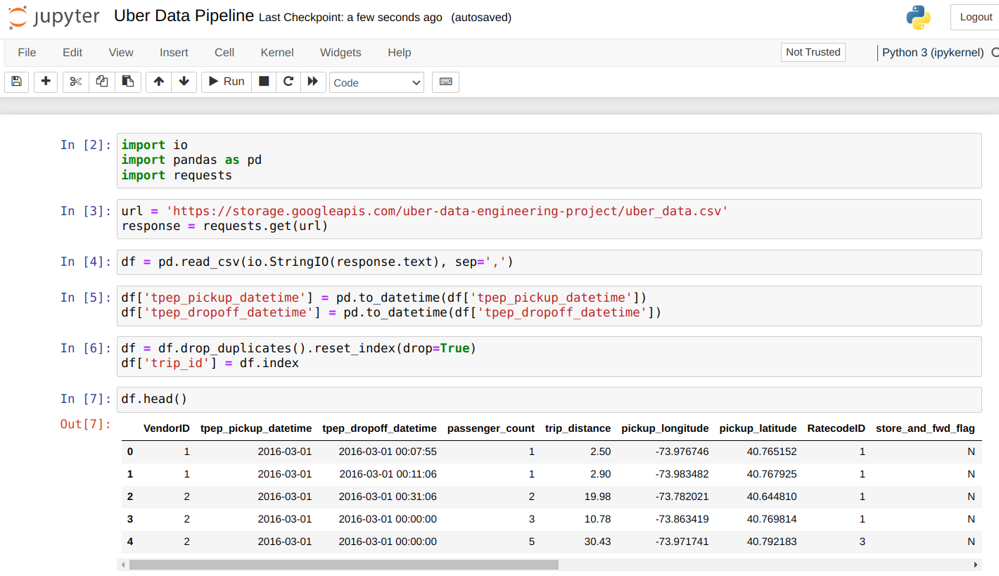
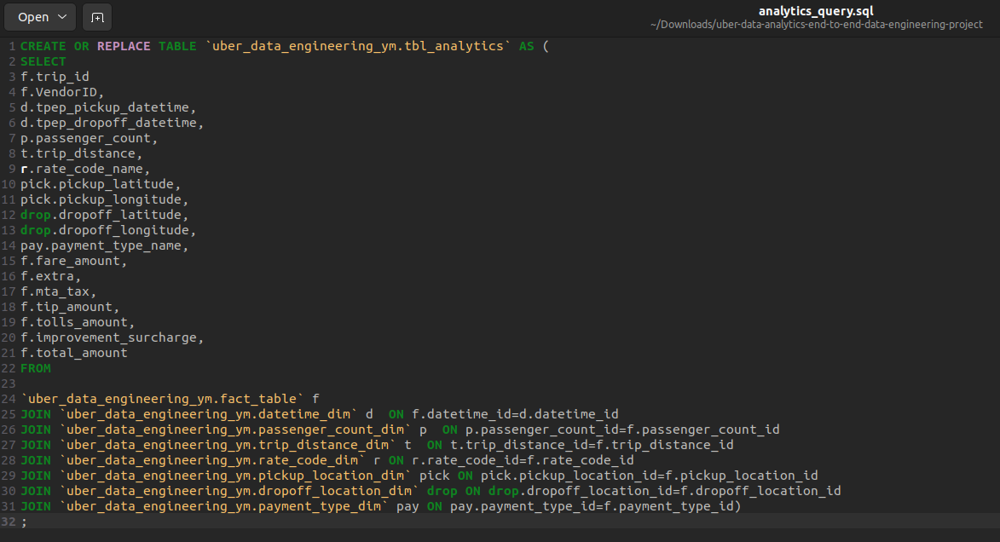
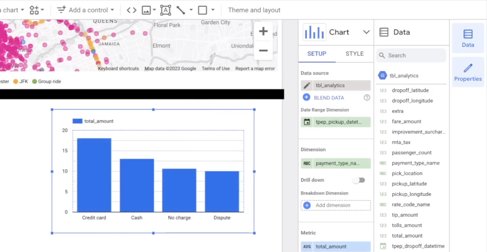

# Uber Data Analytics | Modern Data Engineering GCP Project

Created by Yuvraj M

## Introduction

The goal of this project is to perform data analytics on Uber data using various tools and technologies, including GCP Storage, Python, Compute Instance, Mage Data Pipeline Tool, BigQuery, and Looker Studio.

## Uber Data Pipline Project Insights Dashboard

## Architecture

## Technology Used
- Programming Language - Python

Google Cloud Platform
1. Google Storage
   Google Cloud Storage is an online file storage service provided by Google as parts of its cloud computing Platform.
   It allows you to store and retrieve data in the cloud making it accessible from anywhere with an internet connection
2. Compute Instance
   An instance is a virtual machine (VM) hosted on Google's infrastructure
   The terms Compute Engine instance, virtual machine instance , VM instance, and VM are synonymous.
   They are used interchangeably in the Google Cloud console, the gcloud command-line tool, and the REST API
3. BigQuery
   BigQuery is a fully managed enterprise data warehouse that helps you manage and analyse your data with built-in features like machine learning, geospatial analysis, and business intelligence.
4. Looker Studio
   Business Insights Visualizations: Looker Studio turns your data into fully customizable informative reports and dashboards that are easy to read and share. Insights can be gathered from a variety of sources, including
   Google Analytics, Google Sheets, BigQuery.

Modern Data Pipeine Tool - https://www.mage.ai/
Mage is an open-source data pipeline tool for transforming and integrating data

Contibute to this open source project - https://github.com/mage-ai/mage-ai

## Dataset Used
TLC Trip Record Data
Yellow and green taxi trip records include fields capturing pick-up and drop-off dates/times, pick-up and drop-off locations, trip distances, itemized fares, rate types, payment types, and driver-reported passenger counts.

More info about dataset can be found here:
1. Website - https://www.nyc.gov/site/tlc/about/tlc-trip-record-data.page
2. Data Dictionary - https://www.nyc.gov/assets/tlc/downloads/pdf/data_dictionary_trip_records_yellow.pdf

## Data Model

## Step 1: Creating Fact & Dimension Table

Fact Table:
- Contains the quantitative measures or metrics used for analysis
- Typically contains foreign keys that link to dimension tables
- Contains columns that have high cardinality and change frequently  
- Contains columns that are not useful for analysis by themselves, but are necessary for metric calculation

Dimension Table:
- Contains columns that describe attributes of the data being analysed
- Typically contains primary keys that link to fact tables
- Contains columns that have low cardinality and do not change frequently
- Contains columns that can be used for grouping or filtering data for analysis

Jupyter Notebook (pandas) and the data csv file:

Change Pickup_datetime and dropoff_datetime rom object data type to datetime type. This allows extraction of information from the data.

Using the data model, reset the index and drop the duplicates. Then extract the required hour, day, month, year, weekday and assign to the new columns created for pick hour, pick day, pick month, etc.

Order the data into the correct format ensuring the correct primary key.

For all required data in the data model, drop dupliclicates, reset the index, assign the index to the required ID column and reorder the information as per the data dimension model.

For ratecodeID, we require the rate_code_name which is not in the data frame.
Therefore, create a data dictionary, drop the duplicates, reset the index, and assign the index to ratecodeID. Use the rate_code_name and map to the ID so the value is assigned to the standard rate. Finally reorder as per the data model.

Now that all Dimension Tables created, create the Fact Table by joining the dimension tables based on the common columns between the tables.

## Step 2: Google Cloud Storage and Mage.ai Set Up

Create a bucket and upload data csv file to Google Cloud Storage for public access by python code. Edit permission to fine grained access.

Create a VM instance, connect SSH, install python and dependencies on the virtual machine. Install mage and start a new project hosted on local host port. Edit firewall rules and create a firewall rule to allow specific port number access to mage UI.

## Step 3: Mage UI Python Function Implementation

Load Uber data csv by passing the url to the data stored on Google Cloud Storage. Extract the data and load into csv format for usage by mage.

Accept the data from the upstream load block and pass to the Transformer block. Transform the data into the correct structure using the data model.

Create a transformation function using the code logic used to create the fact and dimension table in the jupyter notebook.

Print the fact table to ensure success.

Each dataframe converted into dictionary format. This is the method to pass multiple dataframes using load function to load data to bigquery.

Data exporter: Data is loaded from the API, transformation function works correctly, and transformed code has been passed in the dictionary.

## Step 4: Load Data into Google BigQuery

Create Data exporter block Google (BigQuery).
Set config path using io.config.yaml file which contains the credentials to connect to BigQuery cloud computing platform.

Google Cloud > API & Services > Credentials 
Create credentials service account with the BigQuery Admin access role.
Create a JSON new key

Using the downloaded JSON file for the new key, copy the credentials into the Mage yaml file.

Google Cloud > Big Query (Data Warehouse and Analytics) 
Create a dataset and copy dataset name to Mage
Create a new SSH connection on VM instance and install google-cloud packages and pip packages to the VM.

Using the Data exporter, Create function to export fact_table to BigQuery

Implement exporter function for all data frames in the data model.
For loop efficiently exports all data frames into target BigQuery dat set as required.

## Step 5: SQL Data Analytics in Google BigQuery

SQL query to SELECT important/valuable columns from the required tables to generate data driven insights from. Directly join the tables using primary and foreign keys.

Example analytics: Query average uber trip tip based on payment type (Does card payments or cash payment result in a higher or lower tip on average)

SQL query to pull data from required tables.
Create a new table without duplicates called tbl_analytics

## Step 6: Create Dashboard for Data Analysis using Looker Studio

Add data to report/dashboard using BigQuery as Data Source
Add tbl_analytics
Create filters to filter information and scorecards to present information.
Create new field -> CONCAT (pickup_latitude, pickup _longitude), add map as chart, and select created field to create map.

Create charts to display information to generate/drive insights.

## Repository / Files

data
├─ uber_data.csv

Docs

mage python files
├─ extract.py
├─ load.py
├─ transform.py

analytics_query.sql

commands.txt

get-pip.py

README.md

Uber Data Pipeline.ipynb

